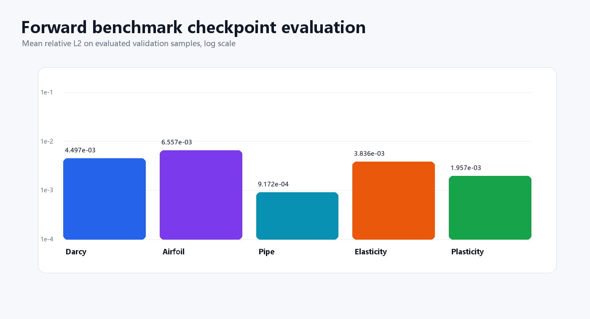
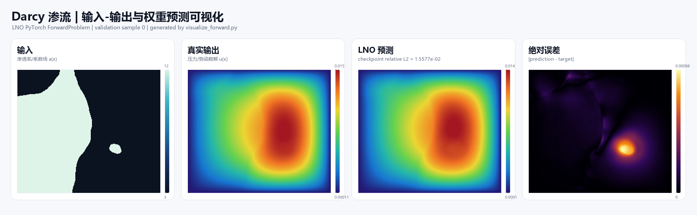
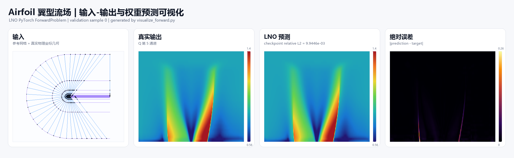
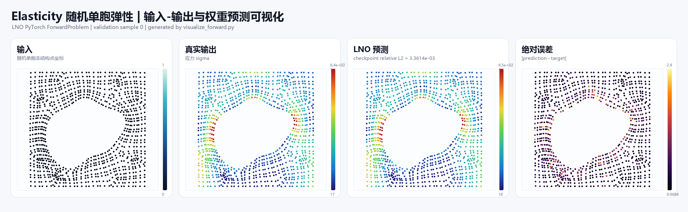
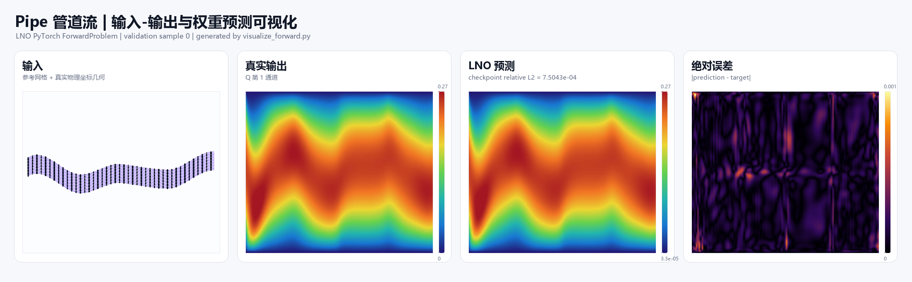
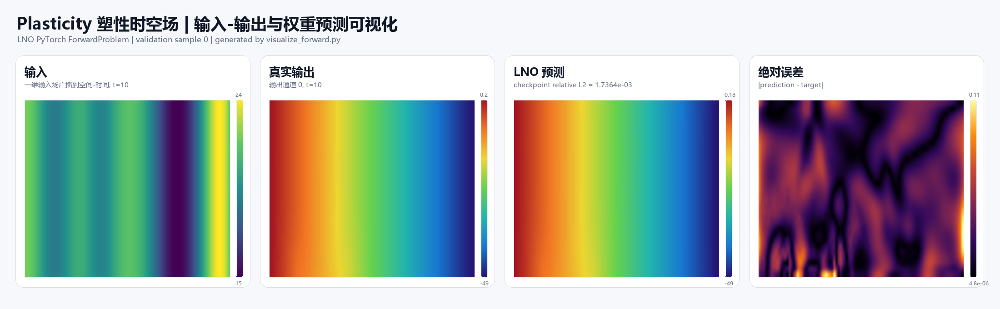

# Latent Neural Operator 复现与分析

> 基于论文 **Latent Neural Operator for Solving Forward and Inverse PDE Problems** (NeurIPS 2024) 的 PyTorch 复现、数据集解析、模型分析、训练权重评估与可视化项目。

本项目围绕 Latent Neural Operator (LNO) 的前向 PDE 求解任务展开复现。复现工作覆盖论文阅读、代码结构梳理、五个 Forward benchmark 的数据理解与预处理分析、LNO 模型实现解读、已有训练权重的评估，以及输入-输出-预测误差的可视化展示。项目目标不是简单运行原代码，而是将 LNO 的物理问题、数据张量、潜空间算子学习机制和实验结果整理成一个可说明、可复查、可展示的复现工程。

<p align="center">
  
  <br>
  <b>Figure 1.</b> 已训练权重在五个 Forward 数据集上的快速评估结果。
</p>

## 项目亮点

- 复现并整理 LNO 在五个前向 PDE benchmark 上的训练结果：Darcy、Airfoil、Elasticity、Plasticity、Pipe。
- 系统梳理 `prepare.py`、`dataset.py`、`model.py`、`exp.py` 中的数据流和模型流，明确每个任务的输入、输出和物理含义。
- 编写中文数据集文档 [data.md](data.md)，覆盖原始文件、变量 shape、预处理逻辑、模型实际输入输出张量。
- 编写中文算法文档 [algorithm.md](algorithm.md)，解释 LNO、Physics-Cross-Attention、潜空间 Transformer、训练配置和反问题扩展。
- 基于 `ForwardProblem/experiments` 中已有 checkpoint，编写独立评估与可视化脚本 [visualize_forward.py](LNO-PyTorch/ForwardProblem/visualize_forward.py)。
- 生成五个数据集的输入、真实输出、模型预测和绝对误差四联图，用于直观展示模型到底“看见什么、预测什么、误差在哪里”。

## 论文背景

神经算子方法旨在学习函数到函数的映射，适用于参数化 PDE、复杂几何场景和多组边界/初始条件下的快速预测。传统 Transformer 类神经算子通常在原始几何空间中对所有采样点建模，当采样点数量很大时，注意力计算和显存开销迅速上升。

LNO 的核心思想是在**可学习潜空间**中进行算子学习：

1. 使用 Physics-Cross-Attention (PhCA) 将几何空间中的输入函数表示编码为少量潜空间 token。
2. 在潜空间中堆叠 Transformer block，学习 PDE 算子映射。
3. 使用反向 PhCA 将潜空间表示解码回预测位置，从而保持输入观测位置与输出查询位置的解耦。

这种设计兼顾了 Transformer 的表达能力和潜空间建模的效率，也使模型天然适用于不规则网格、插值、外推和反问题场景。

## 复现内容

### 1. 数据集复现与解析

本项目重点复现五个 Forward 数据集。代码中所有前向数据最终被组织为统一格式：

```python
{
    "x":  x,   # 查询/参考坐标
    "y1": y1,  # 输入函数、几何信息或输入物理场
    "y2": y2,  # 监督目标，即待预测物理量
}
```

训练时，高维网格或点云会被展平为点序列：

```text
x  : [B, ..., x_dim]  -> [B, N, x_dim]
y1 : [B, ..., y1_dim] -> [B, N, y1_dim]
y2 : [B, ..., y2_dim] -> [B, N, y2_dim]
```

五个数据集的任务定义如下：

| 数据集 | 物理/工程问题 | 输入 | 输出 | 网格类型 |
| --- | --- | --- | --- | --- |
| Darcy | 二维多孔介质稳态渗流 | 渗透率/系数场 `a(x)` 与坐标 | 压力/势函数解 `u(x)` | 规则网格 |
| Airfoil | NACA 翼型流场预测 | 参考坐标与翼型真实几何坐标 | `Q` 的目标流场通道 | 不规则几何映射 |
| Elasticity | 随机单胞材料弹性响应 | 非结构点坐标 | 应力标量 `sigma` | 不规则点云 |
| Plasticity | 塑性成形时空场预测 | 空间-时间坐标与输入函数 | 4 通道时空输出场 | 空间-时间网格 |
| Pipe | 参数化管道流场预测 | 参考坐标与管道真实几何坐标 | `Q` 的目标流场通道 | 不规则几何映射 |

更详细的数据文件、变量维度、预处理方式见 [data.md](data.md)。

### 2. 算法模型复现与理解

前向问题默认使用 `ForwardProblem/module/model.py` 中的 `LNO` 类。其主要模块包括：

| 模块 | 作用 |
| --- | --- |
| `trunk_projector` | 将查询/参考坐标投影到隐藏维度 |
| `branch_projector` | 将输入函数或几何信息投影到隐藏维度 |
| `attention_projector` | 生成几何空间到潜空间、潜空间到几何空间的注意力权重 |
| `attn_blocks` | 在潜空间 token 上堆叠 Transformer block |
| `out_mlp` | 将隐藏表示映射到目标物理量维度 |

前向传播可概括为：

```text
输入坐标 x, 输入函数 y
        |
        v
MLP 投影到隐藏空间
        |
        v
PhCA 编码: [B, N, D] -> [B, M, D]
        |
        v
潜空间 Transformer: [B, M, D] -> [B, M, D]
        |
        v
PhCA 解码: [B, M, D] -> [B, N, D]
        |
        v
MLP 输出预测物理场
```

其中 `N` 是原始几何空间采样点数，`M` 是潜空间 token 数。默认配置中 `M=256`，显著小于 Darcy、Plasticity 等任务中的原始点数，因此模型能够在更紧凑的潜空间中学习算子映射。

更完整的模型结构、注意力选项、损失函数、优化器和配置说明见 [algorithm.md](algorithm.md)。

### 3. 训练权重与实验目录

已复现的训练结果位于：

```text
LNO-PyTorch/ForwardProblem/experiments/
  LNO_Airfoil/
  LNO_Darcy/
  LNO_Elasticity/
  LNO_Pipe/
  LNO_Plasticity/
```

每个实验目录包含：

| 子目录 | 内容 |
| --- | --- |
| `checkpoint/` | 按 epoch 保存的模型权重 |
| `log/` | 训练日志、TensorBoard event、loss/lr 曲线 |
| `para/` | 运行参数和配置备份 |
| `src/` | 实验时源码快照 |

训练日志中的最终记录如下：

| 数据集 | Checkpoint | 训练日志记录 | Train Loss | Val Loss |
| --- | --- | ---: | ---: | ---: |
| Darcy | `500.pt` | epoch 500 | 0.002197 | 0.005020 |
| Airfoil | `500.pt` | epoch 500 | 0.002564 | 0.005782 |
| Elasticity | `500.pt` | epoch 500 | 0.004068 | 0.005088 |
| Pipe | `500.pt` | epoch 500 | 0.001049 | 0.002831 |
| Plasticity | `500.pt` | epoch 500 | 0.022649 | 0.002856 |


## 可视化与权重评估

为了展示 LNO 在不同物理任务中的输入输出关系，我编写了独立脚本：

```text
LNO-PyTorch/ForwardProblem/visualize_forward.py
```

该脚本不依赖原训练入口中的 CUDA/NCCL/DDP，可直接在 CPU 环境下加载 checkpoint，完成：

- 原始数据读取与任务级预处理；
- 模型结构重建与 checkpoint 加载；
- 验证样本相对 L2 误差评估；
- 输入、真实输出、预测输出、绝对误差四联图绘制；
- `metrics.json` 和可视化报告生成。

运行示例：

```powershell
& 'C:\Users\Lenovo\anaconda3\envs\computervision\python.exe' `
  .\lno\LNO-PyTorch\ForwardProblem\visualize_forward.py `
  --max-eval-samples 5 `
  --device cpu
```

输出目录：

```text
outputs/forward_visualization/
```

### 快速评估结果

下表为 `visualize_forward.py` 在每个数据集 5 个验证样本上的快速评估结果，指标为 mean relative L2。该表用于确认权重加载和预测可视化流程，不等同于完整论文 benchmark 统计。

| 数据集 | Checkpoint | 样本数 | Mean rL2 | Std rL2 |
| --- | --- | ---: | ---: | ---: |
| Darcy | `500.pt` | 5 | 4.4969e-03 | 5.5566e-03 |
| Airfoil | `500.pt` | 5 | 6.5572e-03 | 4.3827e-03 |
| Elasticity | `500.pt` | 5 | 3.8359e-03 | 1.2237e-03 |
| Pipe | `500.pt` | 5 | 9.1724e-04 | 4.0648e-04 |
| Plasticity | `500.pt` | 5 | 1.9575e-03 | 1.7697e-04 |

### 可视化样例

<p align="center">
  
  <br>
  <b>Darcy.</b> 输入为系数场，输出为二维稳态渗流解场。
</p>

<p align="center">
  
  <br>
  <b>Airfoil.</b> 输入包含参考网格和翼型物理几何坐标，输出为目标流场通道。
</p>

<p align="center">
  
  <br>
  <b>Elasticity.</b> 输入为随机单胞非结构点坐标，输出为应力标量场。
</p>

<p align="center">
  
  <br>
  <b>Pipe.</b> 输入包含参考网格和参数化管道真实几何坐标，输出为管道流场通道。
</p>

<p align="center">
  
  <br>
  <b>Plasticity.</b> 输入为广播到空间-时间网格的输入函数，输出为多通道塑性时空场。
</p>

## 目录结构

```text
lno/
  README.md                         # 复现项目说明
  data.md                           # 五个 Forward 数据集中文说明
  algorithm.md                      # LNO 算法与代码实现中文说明
  2406.03923v5.pdf                  # 论文原文
  outputs/forward_visualization/    # 复现权重评估与可视化结果
  LNO-PyTorch/
    ForwardProblem/
      configs/                      # 五个 Forward 任务配置
      experiments/                  # 已训练 checkpoint 与日志
      module/                       # LNO 模型、数据集、loss、utils
      prepare.py                    # 原始数据预处理
      exp.py                        # 原训练入口
      visualize_forward.py          # 本项目新增评估与可视化脚本
    InverseProblem/                 # 反问题相关代码
```

## 环境说明

原论文 README 建议 Python 3.9。本次复现和可视化整理主要在本地 Conda 环境 `computervision` 中进行：

```text
Python 3.11.13
PyTorch 2.8.0+cpu
NumPy / SciPy / Pillow
```

由于原始训练脚本使用 `torch.distributed.init_process_group("nccl")` 和 CUDA 设备，本项目新增的 `visualize_forward.py` 采用独立 CPU 推理流程，以便在无 CUDA/NCCL 的环境中完成 checkpoint 验证与可视化。

## 个人理解与进一步思考

LNO 的核心贡献在于把 PDE 算子学习从原始几何空间压缩到可学习潜空间中，并利用 Transformer attention 在潜空间中建模输入函数到输出函数的映射。相比直接在全量网格点上做 attention，这种设计在表达能力、灵活性和计算效率之间取得了较好的平衡。论文还通过不同 attention 实现、参数共享策略、潜空间采样数等消融实验，验证了 PhCA 和潜空间建模设计的有效性，并在多个 forward benchmark 和 Burgers 反问题上展示了较强性能。

在复现和阅读代码的过程中，我认为后续仍有以下值得探索的方向：

1. **前向问题复杂性升级**：当前 benchmark 已覆盖规则网格、不规则几何、点云和时空场，但仍以标准公开数据集为主。可以进一步尝试更复杂的多物理场耦合、强非线性边界条件、三维几何或真实工业仿真数据。
2. **反问题 benchmark 扩展**：论文主要使用 Burgers 方程构造反问题。后续可在 Darcy 反演、弹性参数识别、流场稀疏重建、医学/地球物理成像等任务上验证 LNO 的泛化能力。
3. **潜空间几何先验**：当前潜空间主要通过数据端到端学习，缺少显式物理或几何约束。可以研究在潜 token 中加入对称性、边界、拓扑、守恒律或局部邻域结构等先验。
4. **Attention 效率优化**：虽然 LNO 已将注意力计算转移到较短的潜序列上，但在高分辨率、多时间步或三维任务中，编码/解码与潜空间 self-attention 仍可能成为瓶颈。可探索 FlashAttention、低秩注意力、稀疏注意力或多尺度潜空间设计。
5. **误差可解释性**：从可视化结果看，不同数据集的误差分布具有明显的物理结构。后续可结合边界区域、几何曲率、材料界面或时间步演化分析误差来源，而不仅报告整体 relative L2。

这些问题也说明 LNO 不只是一个可复现实验模型，更是一个适合继续扩展的神经算子研究框架。

## Citation

原论文引用如下：

```bibtex
@inproceedings{wang2024LNO,
  title={Latent Neural Operator for Solving Forward and Inverse PDE Problems},
  author={Tian Wang and Chuang Wang},
  booktitle={Advances in Neural Information Processing Systems (NeurIPS)},
  year={2024}
}
```

## Acknowledgement

本复现项目基于 LNO 原论文与开源代码整理，并参考了以下神经算子相关工作和数据来源：

- Latent Neural Operator: https://arxiv.org/abs/2406.03923
- NeuralOperator / FNO benchmark: https://github.com/neuraloperator/neuraloperator
- Geo-FNO benchmark: https://github.com/neuraloperator/Geo-FNO
- GNOT: https://github.com/thu-ml/GNOT
- Transolver: https://github.com/thuml/Transolver
